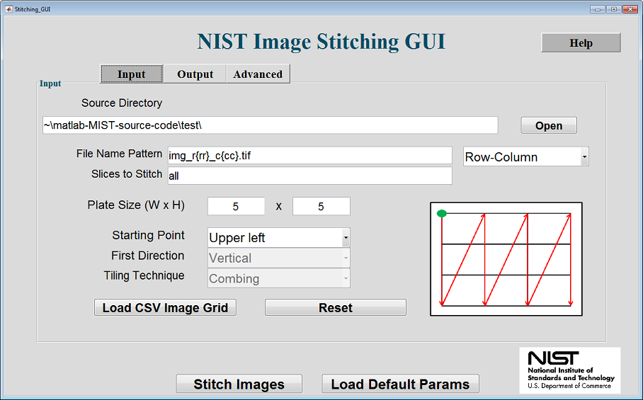
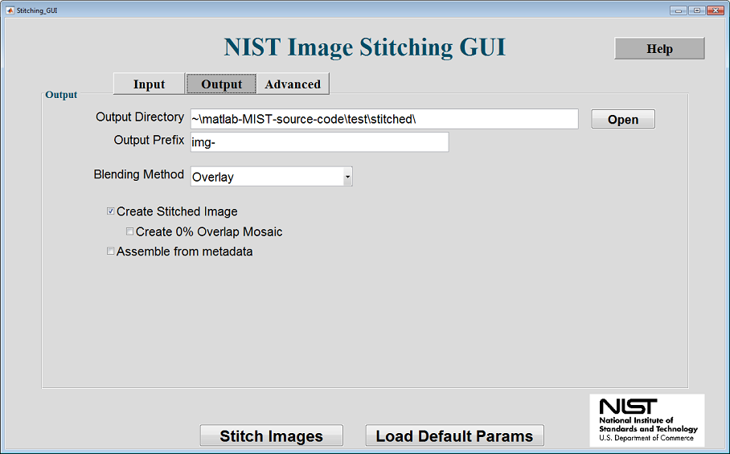
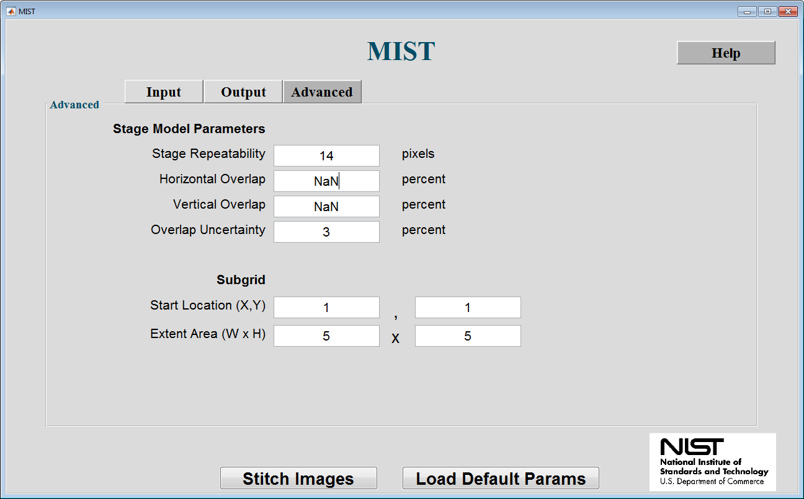

# MIST User Guide

## Contents
1. [Launching MIST](#launching-mist)
2. [Installation Validation Test](#installation-validation-test)
3. [MIST Graphical User Interface](#mist-graphical-user-interface)
  1. [Input Parameters](#input-parameters)
  2. [Output Parameters](#output-parameters)
  3. [Advanced Parameters (optional)](#advanced-parameters-optional)

***

### Launching MIST

1. From Source
  1. Start MATLAB
  2. Navigate to the MIST source code folder
  3. Run: 'src/MIST.m'
2. From Executable
  1. Run 'MIST_Installer_web.exe' [(download link)](https://isg.nist.gov/deepzoomweb/resources/csmet/pages/image_stitching/image_stitching.html) to install the MIST MATLAB application into a directory of your choice
  2. Navigate to where MIST was installed
  3. Run: 'application/MIST.exe'

***
### Installation Validation Test

In this section, we will walk through setting up running MIST on one of the 5x5 image tile datasets in order to validate that the everything is installed correctly.

1. Download test images: [Cy5_ImageTiles.zip ~ 54 MB](https://github.com/NIST-ISG/MIST/wiki/testdata/Small_Fluorescent_Test_Dataset.zip)
2. Extract Cy5_ImageTiles.zip into a directory
3. [Launch MIST](#launching-mist)
5. Manually enter the following parameters into the Input Tab
  1. **Source Directory**: '\[extractionPath\]/Small_Fluorescent_Test_Dataset/image-tiles/'
  2. **Filename Pattern**: 'img_r{rrr}_c{ccc}.tif' and 'Row-Column' drop-down
  3. **Plate Size (W x H)**: '5', '5'
  4. **Starting Point**: 'Upper Left'
6. Select Output Tab and update **Output Directory** option
7. Click **Stitch Images** to launch
8. Output stitched images should be saved in '\[MIST directory\]/test/stitched/'
9. (Optional) Compare the newly generated stitched image to reference stitched image shipped with the dataset
  1. Open '\[extractionPath\]/Small_Fluorescent_Test_Dataset/stitched-image/img-stitched-0.tif' in Fiji/ImageJ.
  2. Check that the new stitched image has the same dimensions as the reference
  3. Perform a pixel-wise comparison between the stitched images
    1. Fiji>>Process>>Image Calculator
    2. The operation new stitched image "Difference" reference stitched image should produce an image containing all zeros when using loaded parameters.

***

### MIST Graphical User Interface

The MIST gui consists of three tabs. Below, we outline each tab and discuss all of the parameters. All options labeled with an \* are required in order to start stitching. Each tab contains a **Help** button that, when clicked, generates a local copy of this documentation.

***

#### Input Parameters

> **Stitch Images** Button - Launches the stitching experiment.

> **Load Default Params** Button - Loads the set of default parameters.

> \* **Source Directory** - The directory where the source images are located. Select browse to open a directory browser.

> \* **Filename Pattern** - Used to load images from a directory. Pattern type (dropdown) is used to specify the type of file pattern. Possible options: **Sequential** and **Row-Column**.
> * If the **Filename Pattern Type** = **Sequential**, then the **Filename Pattern** expects sequential style numbering.

>         Example 1: Img_pos0001_c01.tif = Img_pos{pppp}_c01.tif
>         Examples 2: Img_pos001_time001.tif = Img_pos{ppp}_time{ttt}.tif
>         {ppp} - Special text that represents position numbering between 0 and 999. Increase the number of p's to represent larger numbers.
>         {ttt} - Special text that represents timeslice number between 0 and 999. Each value of {ttt} will be stitched independently. Increase the number of t's to represent larger numbers. Specifying time slices is optional.

> * If the **Filename Pattern Type** = **Row-Column**, then the **Filename Pattern** expects row-column style numbering.

>         Example 1: Img_r1_c1.tif = Img_r{r}_c{c}.tif
>         Example 2: Img_row01_col01_time01.tif = Img_row{rr}_col{cc}_time{tt}.tif
>         {rr} - Special text for row numbering between 0 and 99. Increase the number of r's to represent larger numbers.
>         {cc} - Special text for column numbering between 0 and 99. Increase the number of c's to represent larger numbers.
>         {ttt} - Special text that represents timeslice number between 0 and 999. Each value of {ttt} will be stitched independently. Increase the number of t's to represent larger numbers. Specifying time slices is optional.

> **Slices to Stitch** - The number of timeslices to stitch. Leave this field blank or enter 'all' to stitch all timeslices. To stitch timeslices you must add the spcial format text **{ttt}** to the **File Name Pattern**. This input supports a comma separated list and/or a range using a '-'.
>          Example: "1-25,35,45" stitches timeslices 1 through 25, 35, and 45.

> \* **Plate Size (W & H)** - The number of images in a row, the width of the image grid. The number of images in a column, the height of the image grid.

> \* **Starting Point** - The starting point of the microscope scan. Possible options: **Upper Left**, **Upper Right**, **Lower Left**, and **Lower Right**.

> \* **First Direction** - The direction the microscope moves. Possible options: **Vertical** and **Horizontal**.

> \* **Tiling Technique** - The motion pattern of the microscope. Possible options: **Combing** and **Continuous**.

> **Load CSV Image Grid** Button - Loads an image grid from a .csv file where each entry in the .csv file is an image name.

> **Reset** Button - Resets an image name grid loaded from .csv file.
***

#### Output Parameters

> **Stitch Images** Button - Launches the stitching experiment.

> **Load Default Params** Button - Loads the set of default parameters.

> **Output Directory** - Specifies the location to save images and metadata.

> **Filename Prefix** - The prefix given to output files.

> **Blending Method** - Selects the blending mode to be used for computing the mosaic image.
> Blending Types:
> * Overlay - Choose only one pixel from overlapping pixels based on highest accuracy
> * Linear - Smoothly alters the intensity of the overlapping area between images. Smoothness is determined by alpha. Value should be between (0, 5]
> * Average - Computes the average intensity
> * Min - Choose the minimum pixel from overlapping pixels
> * Max - Choose the maximum pixel from overlapping pixels

> **Create Stitched Image** - Toggles whether the stitched image is created.

> **Create 0% Overlap Mosaic** - Generates the stitched image assuming 0% overlap.

> **Assemble from metadata** - Generates the image mosaic using metadata from a previous run. **Important**:_You must specify the output directory in the [output tab](#output-parameters) to refer to the output directory of your previous run._

***

#### Advanced Parameters (optional)

> **Stage Repeatability** - Sets the stage repeatability variable when computing the global optimization. This value is used to represent the repeatability of the microscope stage movement. It is used for determining the search space of the hill climbing algorithm. This field can contain 'NaN' or be left blank to use the default value.

> **Image Overlap Uncertainty** - Sets the overlap uncertainty variable when computing the global optimization. This value is used to specify the range when filtering translations as good or bad. It is used in conjunction with the horizontal and vertical overlap variables. This field can contain 'NaN' or be left blank to use the default value.

> **Estimated Overlap (Horz, Vert)** - Sets the horizontal/Vertical overlap variable when computing the global optimization. This value is used to filter translations as good or bad. Good translations are used to identify the optimal starting position for the hill climbing algorithm. Setting this value can improve the accuracy of the image mosaic. This field can contain 'NaN' or be left blank to use the default value.

> **Start Location (X,Y)** - X: the start column for the subgrid. Y: the start row for the subgrid.

> **Extent Area (W x H)** - W: the width for the subgrid. H: the height for the subgrid.

***

\* - required in order to start stitching
